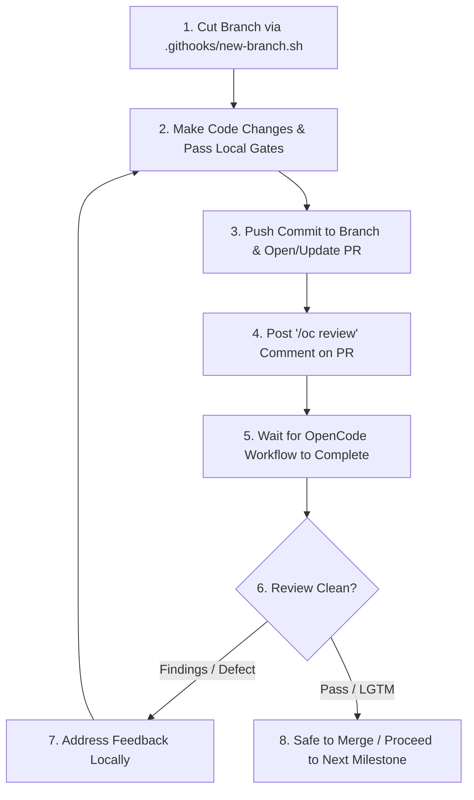

# AFTERGLOW 2.0: MASTER REDESIGN & AGENT IMPLEMENTATION PLAN

**Document Version:** 2.1.0  
**Target Codebase:** `afterglow` (Vanilla ES6 / CSS / HTML / Node Test Harness)  
**Target Systems:** Desktop Web & Mobile Web Responsive Architecture, Core 2.0 Simulation Engine, Pluggable Live-Ops Content Engine  
**Execution Standard:** Zero-Dependency, Backward-Compatible Save Migrations, Deterministic Simulation, Automated Test & Pacing Gates Passing, Mandatory OpenCode Review on Every Commit.

---

## 1. Executive Summary & Design Vision

**Afterglow 2.0: Neon Syndicate** transforms Afterglow from a passive spreadsheet idle game into a rich, immersive, tactile nightclub management tycoon with:
1. **A Granular Reactive DOM & Canvas Architecture:** Eliminates the 4Hz monolithic `innerHTML` re-render that caused scroll jank and input lag, replacing it with fine-grained DOM bindings and a 60 FPS HTML5 Canvas floorboard.
2. **Dual-Surface Desktop & Mobile-First Cockpit:** Solves the classic mobile web incremental problem via `100dvh` dynamic viewports, a bottom thumb cockpit for one-handed play, touch-friendly >=44x44px targets, single-scroller gesture containment, and swipeable bottom-sheet drawers.
3. **Deep 4-Phase Shift Operations:** Replaces passive timers with interactive Warmup, Peak, Last Call, and After Hours phases featuring Police Heat and Bribe dilemmas.
4. **Active Station Subsystems & Synergies:** Mixology Bar drink tiers, DJ beat-syncing Frenzy drops, lighting rig strobes, and Velvet Rope bouncer policies.
5. **Divergent Builds & Personas:** Techno Bunker, Velvet VIP Lounge, and Cyber Speakeasy personas with named talent rosters, traits, and tags.
6. **Multi-Venue Syndicate & Skill Constellation:** City district map with inter-club logistics (VIP shuttles, touring resident DJs) and branching blueprint skill trees.
7. **Modular Live-Ops Content Engine:** Pluggable seasonal expansion packs (e.g., *Season 1: Miami Vice '86*) with independent event worlds, battle passes, and permanent account relics.

---

## 2. Mandatory Review & Commit Workflow (Hard Invariant)

Every AI agent working on this roadmap MUST adhere to this exact review cycle for **every single commit**:



### Review Rules:
1. **No PR Pushed Without Review:** No branch may be merged into `main` without an automated review pass from OpenCode triggered via `/oc review`.
2. **Review on Every Commit:** On every commit pushed to a branch, post `/oc review` in the PR comments and await the run's completion.
3. **Address Findings Before Proceeding:** If the review surfaces any findings, regressions, or style/contract violations, resolve them in a follow-up commit, post `/oc review` again, and verify clearance.

---

## 3. The Mobile Web Architecture & Ergonomics

Mobile Web is the primary challenge for idle games. Afterglow 2.0 introduces a dedicated mobile-first responsive architecture:

```
DESKTOP (>=900px)                      MOBILE (<600px)
+------------------------------------+  +-------------------------+
| HEADER (Brand, Switcher, Shift)    |  | STICKY HUD (Cash, Night)|
+---------+----------------+---------+  +-------------------------+
| LEDGER  | CANVAS         | SYSTEMS |  | CANVAS FLOORBOARD (2D)  |
| Stats   | FLOORBOARD     | Tabs &  |  +-------------------------+
| & Cash  | & STAGE        | Cards   |  | CARDS (Single Scroll)   |
| Flow    |                |         |  |                         |
| (260px) | (Flex 1)       | (380px) |  +-------------------------+
+---------+----------------+---------+  | THUMB COCKPIT (Tabs+CTA)|
| FOOTER (Version & Autosave)        |  +-------------------------+
+------------------------------------+
```

### Mobile Web Technical Invariants:
1. **Dynamic Viewport Unit (`100dvh`):**
   ```css
   .app-root {
     height: 100dvh;
     display: grid;
     grid-template-rows: auto 1fr auto;
     padding-bottom: env(safe-area-inset-bottom, 0px);
     overflow: hidden;
   }
   ```
2. **Bottom Thumb Cockpit (`.thumb-cockpit`):**
   * Pinned to the bottom 64px + safe-area-inset-bottom zone.
   * Houses the primary CTA (`Work the Room` / `Beat Drop`) and 5 core tab icons within easy reach of one thumb.
3. **Single-Scroller Rule:**
   * Mobile uses exactly **one** outer scroll surface (`.mobile-systems-scroller`) with `overscroll-behavior-y: contain`. No nested internal scrollers.
4. **Touch Latency & Target Sizing:**
   * `touch-action: manipulation` across all buttons eliminates the 300ms mobile tap delay.
   * All interactive controls enforce >= 44x44px minimum hitboxes.
5. **Slide-Up Bottom Drawers (`.bottom-drawer`):**
   * Replaces desktop modals with mobile bottom-sheet drawers that slide up from the bottom and dismiss on downward swipe or backdrop tap.

---

## 4. Step-by-Step PR Implementation Roadmap

```mermaid
gantt
    title Afterglow 2.0 Implementation Pipeline
    dateFormat  X
    axisFormat  PR %d
    section Architecture & UI
    PR 1: Reactive UI Store & Granular DOM Engine       :1, 2
    PR 2: Responsive Dual-Surface & Mobile Cockpit      :2, 3
    PR 3: Canvas Floorboard & Web Audio Synthesizer     :3, 4
    section Gameplay Mechanics
    PR 4: 4-Phase Operational Shifts & Police Heat Engine :4, 5
    PR 5: Station Subsystems (Mixology & DJ Beat-Sync)  :5, 6
    PR 6: Club Personas & Named Talent Roster 2.0       :6, 7
    section Meta-Progression & Live-Ops
    PR 7: Branching Blueprint Skill Tree & District Map :7, 8
    PR 8: Pluggable Content Pack Engine & Season 1 Pack :8, 9
```

---

### PR 1: Reactive UI Store & Fine-Grained DOM Engine

* **Objective:** Replace the monolithic 4Hz `root.innerHTML = ...` redraw loop with an observable state store and targeted DOM element bindings.
* **Files to Modify/Create:**
  * `game.js` (refactor `render()` to mount skeleton once; bind reactive signals)
  * `src/core/reactive.js` (new reactive signal & store utility)
  * `economy.test.mjs` (unit tests verifying zero DOM destruction during ticks)
* **Key Invariants:**
  * Persistent DOM nodes are never destroyed on ticks; text nodes update directly via `.textContent`.
  * Native scroll positions and form focus states never jump.
* **Verification & Review:**
  * Local Gates: `node --check game.js && node economy.test.mjs && node pacing.mjs --fast`
  * Post commit $\rightarrow$ comment `/oc review` on PR $\rightarrow$ await and pass OpenCode review.

---

### PR 2: Responsive Dual-Surface & Mobile Bottom-Cockpit

* **Objective:** Implement the dual-surface responsive layout supporting both the 3-Column Desktop Command Deck and the Mobile Bottom-Cockpit.
* **Files to Modify/Create:**
  * `style.css` (mobile media queries, dynamic viewport units, bottom cockpit CSS)
  * `game.js` (drawer view models and viewport-aware template mounting)
  * `index.html`
* **Key Invariants:**
  * Mobile viewport test (390x844px) passes with zero horizontal overflow.
  * All interactive touch targets measure >= 44x44px.
* **Verification & Review:**
  * Local Gates: `node --check game.js && node economy.test.mjs && node pacing.mjs --fast`
  * Post commit $\rightarrow$ comment `/oc review` on PR $\rightarrow$ await and pass OpenCode review.

---

### PR 3: Canvas Floorboard & Web Audio Synthesizer

* **Objective:** Replace static stage graphics with an interactive 60 FPS HTML5 Canvas floorboard and an optional procedural Web Audio API synthwave generator.
* **Files to Modify/Create:**
  * `src/ui/floorboard.js` (HTML5 Canvas floor renderer with crowd particles and lighting sweeps)
  * `src/core/audio.js` (Web Audio API procedural synth kick/bass engine)
  * `game.js`, `style.css`
* **Key Invariants:**
  * Canvas rendering automatically pauses on `document.visibilityState === 'hidden'`.
  * Procedural audio engine loads in < 4KB with zero external MP3 assets.
* **Verification & Review:**
  * Local Gates: `node --check game.js && node economy.test.mjs && node pacing.mjs --fast`
  * Post commit $\rightarrow$ comment `/oc review` on PR $\rightarrow$ await and pass OpenCode review.

---

### PR 4: 4-Phase Operational Shifts & Police Heat Engine

* **Objective:** Replace static shift multipliers with an interactive 4-phase night cycle (Early Doors, Peak Hours, Last Call, After Hours) and replace the strike lock with a Police Heat & Bribe mechanic.
* **Files to Modify/Create:**
  * `catalogs.js` (shift definitions, heat tables, incident catalog)
  * `game.js` (shift progression and heat simulation math)
  * `DESIGN.md` (updated formulas)
  * `economy.test.mjs` (shift and heat test suite)
* **Key Mathematical Formulas:**
  * Net Cash Flow = (R_Door + R_Bar + R_Stage + R_VIP) * M_Shift * M_Hype * M_Brand - Wages
  * Police Heat Rate = BaseHeat(Shift) + Incidents - SecurityScore
* **Verification & Review:**
  * Local Gates: `node economy.test.mjs && node pacing.mjs`
  * Post commit $\rightarrow$ comment `/oc review` on PR $\rightarrow$ await and pass OpenCode review.

---

### PR 5: Station Subsystems (Mixology Bar Inventory & DJ Beat-Sync)

* **Objective:** Introduce active, rewarding station mechanics (Bar liquor stocking and DJ Beat-Sync frenzy drops).
* **Files to Modify/Create:**
  * `catalogs.js` (beverage tiers, bar equipment, DJ tracks)
  * `game.js` (inventory consumption, beat-sync calculation)
  * `economy.test.mjs`
* **Key Invariants:**
  * Automated autobuyers can auto-restock bar inventory once upgraded.
  * Pacing bot ignores manual beat-sync bonuses to ensure deterministic milestone baselines.
* **Verification & Review:**
  * Local Gates: `node economy.test.mjs && node pacing.mjs --fast`
  * Post commit $\rightarrow$ comment `/oc review` on PR $\rightarrow$ await and pass OpenCode review.

---

### PR 6: Club Personas & Named Talent Roster 2.0

* **Objective:** Introduce 3 selectable Club Personas (*Techno Bunker, Velvet VIP Lounge, Cyber Speakeasy*) and Named Talent Cards with traits and synergies.
* **Files to Modify/Create:**
  * `catalogs.js` (personas, talent rosters, tag definitions)
  * `game.js` (synergy multiplier calculations, talent leveling)
  * `DESIGN.md`
  * `economy.test.mjs`
* **Key Invariants:**
  * Bumps `SAVE_VER` to 14 with backward-compatible migration in `MIGRATIONS[13]`.
  * Matching synergy tags provide compounding +50% operational bonuses.
* **Verification & Review:**
  * Local Gates: `node economy.test.mjs && node pacing.mjs`
  * Post commit $\rightarrow$ comment `/oc review` on PR $\rightarrow$ await and pass OpenCode review.

---

### PR 7: Branching Blueprint Skill Tree & District Syndicate Map

* **Objective:** Replace flat prestige perks with a branching Constellation Skill Tree and replace simple room switching with an interactive City District Syndicate Map.
* **Files to Modify/Create:**
  * `catalogs.js` (blueprint tree nodes, district definitions)
  * `game.js` (district logistics engine, multi-club revenue aggregation)
  * `PRESTIGE.md`, `DESIGN.md`
  * `economy.test.mjs`
* **Key Invariants:**
  * Multi-club logistics links (VIP Shuttles, Touring DJs) pass data cleanly without cross-tab desync.
  * All 5 pacing scenarios in `pacing.mjs` continue to pass within target bands.
* **Verification & Review:**
  * Local Gates: `node economy.test.mjs && node pacing.mjs`
  * Post commit $\rightarrow$ comment `/oc review` on PR $\rightarrow$ await and pass OpenCode review.

---

### PR 8: Pluggable Content Pack Engine & Season 1: Miami Vice '86

* **Objective:** Implement the pluggable seasonal content engine and ship *Season 1: Miami Vice ’86* (Dayclub pool venue, 80s synth aesthetic, 30-day battle pass track, permanent Golden Flamingo Relic).
* **Files to Modify/Create:**
  * `src/core/packs.js` (pack loader and registry)
  * `src/catalogs/packs/season1-miami.js` (complete Season 1 definition)
  * `game.js`, `catalogs.js`, `index.html`
  * `economy.test.mjs`
* **Key Invariants:**
  * Content packs can be added or removed without editing core simulation files.
  * Permanent relics earned in seasonal events carry over seamlessly across all prestige resets.
* **Verification & Review:**
  * Local Gates: `node --check game.js && node economy.test.mjs && node pacing.mjs`
  * Post commit $\rightarrow$ comment `/oc review` on PR $\rightarrow$ await and pass OpenCode review.

---

## 5. Agent Quality & Execution Standards

Any AI agent implementing tasks from this roadmap must adhere to the following protocol:

1. **Branching & Pull Request Standard:**
   * Create feature branches using `.githooks/new-branch.sh <slug>`.
   * Commit the durable PR body to `.github/pr/<number>-<slug>.md`.
2. **Review Trigger Mandate:**
   * Every commit pushed to a PR branch MUST be followed by an `/oc review` comment.
   * Agents must wait for the OpenCode review workflow to conclude and resolve any flagged issues before merging or pushing further PRs.
3. **Verification Gates Rule:**
   * Never submit code without running syntax, economy unit tests, and reference-bot pacing suites.
   * `node --check game.js && node economy.test.mjs && node pacing.mjs --fast` must be 100% green.
4. **Save Integrity Rule:**
   * Always preserve backward compatibility for existing saves in `localStorage`.
   * Never overwrite user progress on migration errors; fail closed.
